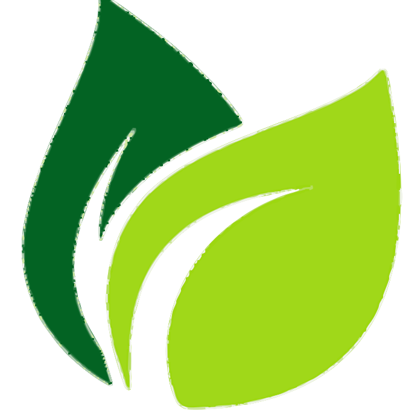

# SVG Turner

**SVG Turner** is a high-performance Node.js engine designed to convert raster images (PNG) into high-quality, scalable vector graphics (SVG).

Unlike simple "trace" tools that merely outline silhouettes, SVG Turner employs a **Color Quantization & Layer Stacking** approach. It intelligently breaks complex, multi-colored images—such as illustrations, logos, and gradients—into distinct color bands, reconstructing the original image with mathematical precision and perfect scalability.

| Input (PNG) | Output (SVG) |
| :---: | :---: |
|  |  |
|  |  |

---

## Features

*   **Smart Color Quantization**: Automatically detects dominant colors using K-Means clustering to split the image into clean layers.
*   **Hybrid Dilation**: A proprietary "Smart Fattener" algorithm that fills internal micro-holes while preserving critical external negative space (preventing the "webbing" effect).
*   **Painter's Algorithm Layering**: Sorts shapes by area to ensure backgrounds sit behind foreground details for perfect reconstruction.
*   **Bezier Curve Fitting**: Transforms jagged pixel edges into smooth, elegant Cubic Bezier curves.
*   **100% Coverage Guarantee**: Ensures every visible pixel is accounted for, eliminating white cracks or missing spots between colors.

---

## Installation

1.  **Clone the repository:**
    ```bash
    git clone https://github.com/Vaciuum/PNG-SVG.git
    cd PNG-SVG
    ```

2.  **Install dependencies:**
    ```bash
    npm install
    ```

---

## Usage

Run the engine directly via the command line:

```bash
node src/main.js <input_image_path> <output_image_path>
```

### Example

```bash
node src/main.js examples/leaf.png examples/leaf_vector.svg
```

This will:
1.  Load `leaf.png`.
2.  Process it using the default configuration (16 colors, 2x scale).
3.  Save the vectorized result to `examples/leaf_vector.svg`.

---

## Configuration

You can fine-tune the vectorization process by modifying the `CONFIG` object in `src/main.js`:

```javascript
const CONFIG = {
    scale: 2.0,            // Upscale factor (higher = smoother curves, slower processing)
    colorCount: 16,        // Number of dominant colors to extract
    minArea: 10,           // Minimum shape size (in pixels) to keep (removes noise)
    smoothingIters: 1,     // Strength of coordinate smoothing before curve fitting
    
    // Hybrid Dilation Settings (The "Secret Sauce")
    dilation: {
        unconditionalPasses: 1,  // Pass 1: Fills internal texture holes
        smartPasses: 1,          // Pass 2: Closes gaps between colors without bleeding
    }
};
```

---

## The Pipeline

The engine follows a sophisticated 8-step pipeline to transform pixels into vectors:

1.  **Extraction & Upscaling**: Loads and optionally upscales the image (bicubic) to smooth pixelation.
2.  **Quantization**: Reduces the image to a fixed palette (e.g., 16 colors) and separates layers.
3.  **Masking**: Converts layers into binary masks.
4.  **Hybrid Dilation**: Intelligently expands shapes to close gaps without destroying details.
5.  **Tracing**: Walks the edges of shapes using Moore Neighbor Tracing.
6.  **Smoothing**: Applies weighted averaging to reduce "stair-stepping".
7.  **Simplification**: Optimizes the shape using the Douglas-Peucker algorithm.
8.  **Curve Fitting & Assembly**: Fits Bezier curves to the points and stacks the layers into the final SVG.

---

## License

This project is open-source and available under the **ISC License**.